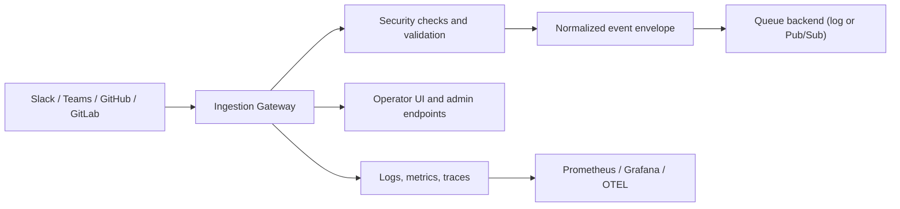

# TeamPulse Bridge

[](https://github.com/kill74/TeamPulseBridge/actions/workflows/ci.yml)
[](https://github.com/kill74/TeamPulseBridge/actions/workflows/smoke.yml)
[](https://github.com/kill74/TeamPulseBridge/actions/workflows/release.yml)
[](https://github.com/kill74/TeamPulseBridge/actions/workflows/docs.yml)
[](./services/ingestion-gateway/go.mod)
[](./LICENSE)

TeamPulse Bridge is a Go codebase for receiving webhook events from developer tools, validating them safely, and forwarding them into a durable pipeline.

In plain English: this repo is the front door for engineering activity signals.

It accepts events from platforms like Slack, Microsoft Teams, GitHub, and GitLab, checks that the requests are real, normalizes them into a consistent envelope, and publishes them to a queue for downstream processing.

## What This Repository Is For

This codebase exists to solve a common integration problem:

- engineering tools all emit events in different formats
- each provider has different auth and signature rules
- teams still need one safe, observable place to receive those events

TeamPulse Bridge gives you that place.

Today, the main runnable service in this repo is the ingestion gateway. Around that service, the repo also includes local developer tooling, infrastructure, GitOps deployment config, and documentation so the project can be run like a real production system instead of just a demo app.

## What It Does

The ingestion gateway currently handles:

- webhook endpoints for Slack, Teams, GitHub, and GitLab
- provider-specific signature or token validation
- rate limiting, request IDs, logging, metrics, and panic recovery
- queue publishing through either a local log backend or Google Pub/Sub
- failed-event capture so replay is possible
- replay audit history for operational visibility
- a built-in operator UI for health checks, config visibility, smoke tests, and replay workflows

## How It Works



## Repository Tour

If you are new here, these are the folders that matter first:

- `services/ingestion-gateway/`: the main Go service that receives and publishes webhook events
- `docs/`: architecture notes, planning docs, and project standards
- `deploy/`: Kubernetes, GitOps, and monitoring configuration
- `infrastructure/`: Terraform for cloud environments
- `site-docs/`: documentation site content
- `.github/workflows/`: CI, release, docs, and governance workflows

Helpful starting points:

- [services/ingestion-gateway/README.md](services/ingestion-gateway/README.md)
- [services/README.md](services/README.md)
- [docs/README.md](docs/README.md)
- [deploy/README.md](deploy/README.md)
- [infrastructure/README.md](infrastructure/README.md)

## Quick Start

### What you need

- Go 1.22+
- Docker and Docker Compose
- Make

### First-time setup

```bash
make doctor
make dev-setup
make dev-check
```

### Run the service

```bash
make run
```

### Run the local stack

This starts the ingestion gateway plus Prometheus and Grafana:

```bash
make up
```

Useful local URLs:

- app UI: `http://localhost:8080/`
- health: `http://localhost:8080/healthz`
- metrics: `http://localhost:8080/metrics`
- Prometheus: `http://localhost:9090`
- Grafana: `http://localhost:3000`

To stop the stack:

```bash
make down
```

### Verify the project

```bash
make verify
```

### Run integration tests

```bash
make integration-test
```

Targeted integration commands:

```bash
make integration-test-queue
make integration-test-handlers
make integration-bench
```

## The Main Service

The main service in this repo is the ingestion gateway.

Its job is to:

1. receive inbound webhook requests
2. verify that they came from a trusted source
3. preserve the payload and key headers
4. publish a normalized event to a queue
5. expose operational tools for replay, auditing, and debugging

Important runtime endpoints include:

- `GET /`
- `GET /healthz`
- `GET /readyz`
- `GET /metrics`
- `POST /webhooks/slack`
- `POST /webhooks/teams`
- `POST /webhooks/github`
- `POST /webhooks/gitlab`
- `GET /admin/configz`
- `GET /admin/events/failed`
- `GET /admin/events/replay-audit`
- `POST /admin/events/replay`
- `POST /admin/events/replay/batch`

For endpoint behavior, config, replay details, and runbook notes, see [services/ingestion-gateway/README.md](services/ingestion-gateway/README.md).

## Common Developer Commands

```bash
make help
```

Useful day-to-day commands:

- `make doctor`: check local tooling and environment readiness
- `make dev-setup`: install local developer dependencies
- `make dev-check`: run a fast local sanity check
- `make verify`: run formatting, linting, tests, and race checks defined by the Makefile
- `make run`: run the gateway locally
- `make up`: run the local stack with monitoring
- `make down`: stop the local stack
- `make docs-build`: build the documentation site
- `make docs-serve`: serve docs locally

Replay helpers:

- `make replay FILE=internal/handlers/testdata/contracts/github_pull_request_opened.json REPLAY_ARGS='-source github -dry-run'`
- `make replay EVENT_ID=<failed_event_id>`

## Local Stack

The included `docker-compose.yml` is designed to make the repo easy to understand locally.

It can run:

- the ingestion gateway
- Prometheus for metrics collection
- Grafana for dashboards
- an optional Pub/Sub emulator profile for queue integration testing

That means you can explore the service as both an app developer and an operator.

## Infrastructure and Deployment

This repo is not just application code. It also includes the pieces needed to run the system in a more production-like way:

- Terraform modules and environment setup under `infrastructure/`
- Kubernetes manifests and overlays under `deploy/k8s/`
- Argo CD GitOps bootstrap under `deploy/gitops/argocd/`
- monitoring dashboards and Prometheus config under `deploy/monitoring/`

Common infrastructure commands:

```bash
make infra-plan-staging
make infra-deploy-staging
make infra-plan-prod
make infra-deploy-prod
make gitops-validate
```

See [infrastructure/README.md](infrastructure/README.md) and [deploy/README.md](deploy/README.md) for the full deployment story.

## Security and Reliability Mindset

This repository is built with production-style defaults in mind. That includes:

- validating webhook secrets and signatures
- protecting admin routes with JWT and CIDR controls when enabled
- limiting request body size
- rate limiting inbound traffic
- structured logging and telemetry
- durable queue publishing
- failed-event persistence and replay workflows

The goal is not just to receive events. The goal is to receive them safely, observe what happened, and recover when something goes wrong.

## If You Want To Explore the Code Quickly

Start here:

- [services/ingestion-gateway/README.md](services/ingestion-gateway/README.md)
- [services/ingestion-gateway/cmd/server/main.go](services/ingestion-gateway/cmd/server/main.go)
- [services/ingestion-gateway/internal/handlers/](services/ingestion-gateway/internal/handlers)
- [services/ingestion-gateway/internal/queue/](services/ingestion-gateway/internal/queue)
- [docs/](docs)

## License

MIT
