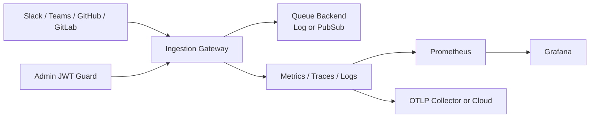

# TeamPulse Bridge

[](https://github.com/kill74/TeamPulseBridge/actions/workflows/ci.yml)
[](https://github.com/kill74/TeamPulseBridge/actions/workflows/smoke.yml)
[](https://github.com/kill74/TeamPulseBridge/actions/workflows/release.yml)
[](https://github.com/kill74/TeamPulseBridge/actions/workflows/docs.yml)
[](./services/ingestion-gateway/go.mod)
[](./LICENSE)

Production-style event ingestion bridge for engineering activity signals (Slack, Teams, GitHub, GitLab), built in Go with strong security, observability, and reliability defaults.

## Project Highlights

- 4 webhook providers supported behind one hardened ingress service (Slack, Teams, GitHub, GitLab)
- 6 production workflows for engineering rigor (ci, smoke, docs, docs-deploy, release, tag-release)
- 8 public HTTP endpoints with auth, health, and metrics coverage
- 100% passing service test suite on current branch
- End-to-end local stack with service plus Prometheus and Grafana for operational visibility

## Architecture



## Why This Repo Looks Professional

- Clean service boundaries and internal package layout
- Signature-verified webhook ingestion for multiple providers
- Async queue publisher abstraction (`log` and Google Pub/Sub backends)
- Structured logging (`slog`), tracing (OpenTelemetry), and Prometheus metrics
- JWT-protected admin/ops routes
- CI pipeline with lint, tests, race detector, vuln scan, and policy-as-code checks (Terraform + Kubernetes)
- Dockerized local stack with Prometheus + Grafana

## Repository Structure

```text
.
├── docs/                          # RFC, ADRs, and planning artifacts
├── infrastructure/                # Terraform IaC for GCP (staging/prod)
│   ├── terraform/                 # Terraform modules and root config
│   ├── scripts/                   # Deployment scripts
│   └── docs/                      # Infrastructure documentation
├── services/
│   └── ingestion-gateway/         # Go webhook ingestion service
├── deploy/
│   └── monitoring/                # Prometheus and Grafana setup
├── site-docs/                     # MkDocs documentation site
├── .github/workflows/             # CI pipeline
├── docker-compose.yml             # Local runtime stack
├── go.work                        # Monorepo Go workspace
└── Makefile                       # Developer commands
```

Repository navigation guides:

- [services/README.md](services/README.md)
- [deploy/README.md](deploy/README.md)
- [infrastructure/terraform/README.md](infrastructure/terraform/README.md)
- [docs/README.md](docs/README.md)
- [docs/repository-standards.md](docs/repository-standards.md)
- [docs/pr-checklists.md](docs/pr-checklists.md)

## Quick Start

### 1) Prerequisites

- Go 1.22+
- Docker + Docker Compose
- Make (or run commands manually)

### 2) Run Tests and Lint

```bash
make verify
```

### 2.1) Developer Onboarding (Recommended)

```bash
make doctor
make dev-setup
make dev-check
```

### 3) Run Service Locally

```bash
make run
```

### 4) Run Full Local Stack (Service + Monitoring)

```bash
make up
```

Then open:

- Product UI: `http://localhost:8080/`
- Service health: `http://localhost:8080/healthz`
- Metrics: `http://localhost:8080/metrics`
- Prometheus: `http://localhost:9090`
- Grafana: `http://localhost:3000` (admin/admin)

### 5) Run Integration Tests (Pub/Sub Emulator)

```bash
make integration-test
```

Targeted runs:

```bash
make integration-test-queue
make integration-test-handlers
make integration-bench
```

The integration tests skip gracefully if `PUBSUB_EMULATOR_HOST` is not set.

## Core Service Endpoints

- `POST /webhooks/slack`
- `POST /webhooks/teams`
- `POST /webhooks/github`
- `POST /webhooks/gitlab`
- `GET /healthz`
- `GET /readyz`
- `GET /metrics`
- `GET /admin/configz`

## Infrastructure as Code

Production deployments managed via Terraform with complete GCP infrastructure:

- **GKE Cluster**: Auto-scaling Kubernetes with regional HA (prod)
- **Cloud SQL**: PostgreSQL with automated backups and point-in-time recovery
- **Networking**: VPC with Cloud Armor, firewalls, and private service connections
- **Monitoring**: Cloud Monitoring dashboards, uptime checks, and alerting
- **Security**: Workload Identity, RBAC, network policies, and service accounts
- **Storage**: GCS buckets with lifecycle management and encryption

**Deploy staging environment:**

```bash
make infra-plan-staging
make infra-deploy-staging
```

**Deploy production environment (requires confirmation):**

```bash
make infra-plan-prod
make infra-deploy-prod
```

See [infrastructure/README.md](infrastructure/README.md) for complete setup guide.

## GitOps Deployment (Argo CD)

This repository now includes a production-ready GitOps layout with Argo CD:

- Kubernetes manifests with Kustomize base + overlays for `staging` and `prod`
- Argo CD app-of-apps bootstrap for environment applications
- Controlled sync policy: automated in staging, manual sync gate in production
- Environment isolation by namespace (`ingestion-gateway-staging` and `ingestion-gateway-prod`)

Paths:

- `deploy/k8s/base`
- `deploy/k8s/overlays/staging`
- `deploy/k8s/overlays/prod`
- `deploy/gitops/argocd`

Render and validate manifests locally:

```bash
make gitops-validate
```

Bootstrap Argo CD on GKE:

```bash
make gitops-bootstrap PROJECT_ID=<gcp-project> CLUSTER=<gke-cluster> REGION=<gke-region>
```

See the operational runbook in `site-docs/docs/runbooks/gitops-argocd.md`.

## Security Defaults

- HMAC/token verification for all webhook providers
- Optional JWT guard for `/metrics` and `/admin/*`
- Fail-fast config validation at startup
- Body size limits and panic recovery middleware

## Development Commands

```bash
make help
```

Useful day-to-day commands:

- `make doctor` to verify local tooling and environment readiness
- `make verify` for formatter, linter, unit tests, and race detector
- `make integration-test` for emulator-backed integration checks
- `make replay FILE=internal/handlers/testdata/contracts/github_pull_request_opened.json REPLAY_ARGS='-source github -dry-run'` to validate and replay payloads
- `make replay EVENT_ID=<failed_event_id>` to replay a persisted failed publish event
- `make up` and `make down` for local stack lifecycle
- `make infra-help` for infrastructure workflows

## Release and Delivery

- `ci.yml` runs Terraform fmt/validate, fmt/vet/tests/race/lint/vuln, and policy-as-code checks for Terraform and Kubernetes manifests
- `smoke.yml` builds Docker images and validates `/healthz` and `/metrics`
- `release.yml` creates GitHub Releases for `vX.Y.Z` tags, publishes signed source artifacts, and appends changelog entries
- `tag-release.yml` enforces automated release checklist gates before creating SemVer tags
- `docs.yml` builds documentation with strict checks
- `docs-deploy.yml` publishes docs to `gh-pages`
- `pr-governance.yml` enforces PR title, labels, and required template sections
- `dependabot.yml` automates weekly dependency updates for Go modules, GitHub Actions, and docs Python packages
- `dependabot-automerge.yml` enables auto-merge only for Dependabot semver patch updates after required checks pass

### Cut a release

1. Go to GitHub Actions.
2. Run `tag-release` workflow with `version` like `v1.0.0` and confirm all checklist gates.
3. `release` workflow publishes the release and updates `CHANGELOG.md`.

## Docs Site

- Build locally: `make docs-build`
- Serve locally: `make docs-serve`
- Production docs deploy automatically from main branch via `docs-deploy.yml`
- Branch protection baseline is documented in `site-docs/docs/runbooks/branch-protection.md`
- Security reporting process is documented in `SECURITY.md`

## Portfolio Showcase

- Recruiter-facing demo checklist: `docs/profile-showcase-checklist.md`
- Architecture and tradeoff talking points: `docs/interview-talking-points.md`
- Suggested screenshot and GIF asset path: `docs/media/`

## Roadmap

- ✅ Add integration tests against Pub/Sub emulator
- ✅ Add Terraform modules for staging/prod environments (complete)
- ✅ Add contract tests for webhook payload compatibility
- ✅ Implement GitOps workflow (Argo CD)
- ✅ Multi-region active-active deployment
- ✅ Custom metrics and SLO dashboards

### Next Release Focus (v1.1.0)

- Reliability game days and automated failover validation
- Policy-as-code guardrails in CI for Terraform and Kubernetes, plus production IAM exception controls
- Expanded provider contract suite with schema drift detection
- Security operations dashboard and alert tuning

See detailed plan in [docs/roadmap-v1.1.0.md](docs/roadmap-v1.1.0.md).

## License

MIT
