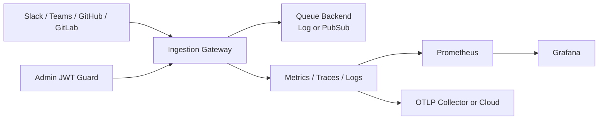

# TeamPulse Bridge

[](https://github.com/guilhermesales/TeamPulseBridge/actions/workflows/ci.yml)
[](https://github.com/guilhermesales/TeamPulseBridge/actions/workflows/smoke.yml)
[](https://github.com/guilhermesales/TeamPulseBridge/actions/workflows/release.yml)
[](https://github.com/guilhermesales/TeamPulseBridge/actions/workflows/docs.yml)
[](./services/ingestion-gateway/go.mod)
[](./LICENSE)

Production-style event ingestion bridge for engineering activity signals (Slack, Teams, GitHub, GitLab), built in Go with strong security, observability, and reliability defaults.

## Project Highlights

- 4 webhook providers supported behind one hardened ingress service (Slack, Teams, GitHub, GitLab)
- 6 production workflows for engineering rigor (ci, smoke, docs, docs-deploy, release, tag-release)
- 8 public HTTP endpoints with auth, health, and metrics coverage
- 100% passing service test suite on current branch
- End-to-end local stack with service plus Prometheus and Grafana for operational visibility

## Architecture



## Why This Repo Looks Professional

- Clean service boundaries and internal package layout
- Signature-verified webhook ingestion for multiple providers
- Async queue publisher abstraction (`log` and Google Pub/Sub backends)
- Structured logging (`slog`), tracing (OpenTelemetry), and Prometheus metrics
- JWT-protected admin/ops routes
- CI pipeline with lint, tests, race detector, and vuln scan
- Dockerized local stack with Prometheus + Grafana

## Repository Structure

```text
.
├── docs/                          # RFC, ADRs, and planning artifacts
├── services/
│   └── ingestion-gateway/         # Go webhook ingestion service
├── deploy/
│   └── monitoring/                # Prometheus and Grafana setup
├── site-docs/                     # MkDocs documentation site
├── .github/workflows/             # CI pipeline
├── docker-compose.yml             # Local runtime stack
├── go.work                        # Monorepo Go workspace
└── Makefile                       # Developer commands
```

## Quick Start

### 1) Prerequisites

- Go 1.22+
- Docker + Docker Compose
- Make (or run commands manually)

### 2) Run Tests and Lint

```bash
make verify
```

### 3) Run Service Locally

```bash
make run
```

### 4) Run Full Local Stack (Service + Monitoring)

```bash
make up
```

Then open:

- Service health: `http://localhost:8080/healthz`
- Metrics: `http://localhost:8080/metrics`
- Prometheus: `http://localhost:9090`
- Grafana: `http://localhost:3000` (admin/admin)

## Core Service Endpoints

- `POST /webhooks/slack`
- `POST /webhooks/teams`
- `POST /webhooks/github`
- `POST /webhooks/gitlab`
- `GET /healthz`
- `GET /readyz`
- `GET /metrics`
- `GET /admin/configz`

## Security Defaults

- HMAC/token verification for all webhook providers
- Optional JWT guard for `/metrics` and `/admin/*`
- Fail-fast config validation at startup
- Body size limits and panic recovery middleware

## Development Commands

```bash
make help
```

## Release and Delivery

- `ci.yml` runs fmt/vet/tests/race/lint/vuln checks
- `smoke.yml` builds Docker images and validates `/healthz` and `/metrics`
- `release.yml` creates GitHub Releases for `vX.Y.Z` tags and appends changelog entries
- `tag-release.yml` lets you create SemVer tags from GitHub Actions manually
- `docs.yml` builds documentation with strict checks
- `docs-deploy.yml` publishes docs to `gh-pages`

### Cut a release

1. Go to GitHub Actions.
2. Run `tag-release` workflow with `version` like `v1.0.0`.
3. `release` workflow publishes the release and updates `CHANGELOG.md`.

## Docs Site

- Build locally: `make docs-build`
- Serve locally: `make docs-serve`
- Production docs deploy automatically from main branch via `docs-deploy.yml`
- Branch protection baseline is documented in `site-docs/docs/runbooks/branch-protection.md`
- Security reporting process is documented in `SECURITY.md`

## Portfolio Showcase

- Recruiter-facing demo checklist: `docs/profile-showcase-checklist.md`
- Architecture and tradeoff talking points: `docs/interview-talking-points.md`
- Suggested screenshot and GIF asset path: `docs/media/`

## Roadmap

- Add integration tests against Pub/Sub emulator
- Add Terraform modules for staging/prod environments
- Add contract tests for webhook payload compatibility

## License

MIT
