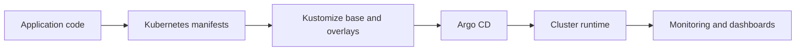

# Deployment

This folder contains the deployment assets for TeamPulse Bridge.

It is the part of the repository that explains how application code becomes running infrastructure.

If `services/` is about what we build, `deploy/` is about how we ship and operate it.

## What Lives Here

- `k8s/`: Kubernetes manifests and Kustomize overlays
- `gitops/`: Argo CD application definitions and bootstrap manifests
- `monitoring/`: Prometheus and Grafana configuration used for observability

## How To Think About This Folder



This folder exists so deployment logic is versioned alongside the code it deploys.

That makes changes easier to review, safer to automate, and easier to roll back.

## Folder Guide

### `k8s/`

Use this when you are changing workload definitions, container settings, probes, environment variables, or environment-specific overlays.

General rule:

- shared behavior belongs in `k8s/base`
- environment-specific behavior belongs in the appropriate overlay

### `gitops/`

Use this when you are changing how Argo CD discovers or syncs applications.

This is where GitOps bootstrap and app-of-apps style wiring lives.

### `monitoring/`

Use this when you are changing local Prometheus config, alert rules, Grafana provisioning, or dashboards.

Current monitoring assets include:

- service overview dashboard
- SLO and error-budget dashboard
- security operations dashboard with rejection burn overlays and top offender panels

## Common Commands

Validate rendered manifests before you commit deployment changes:

```bash
make gitops-validate
```

Bootstrap Argo CD after cluster provisioning:

```bash
make gitops-bootstrap PROJECT_ID=<project> CLUSTER=<cluster> REGION=<region>
```

## Change Rules

- keep base manifests environment-agnostic
- keep environment-specific changes inside overlays
- prefer small additive patches over replacing whole resources
- do not hide environment behavior in copy-pasted manifests
- keep deployment changes reviewable by operators, not just app developers

## Where To Look Next

- [k8s/](k8s)
- [gitops/argocd/README.md](gitops/argocd/README.md)
- [../infrastructure/README.md](../infrastructure/README.md)
