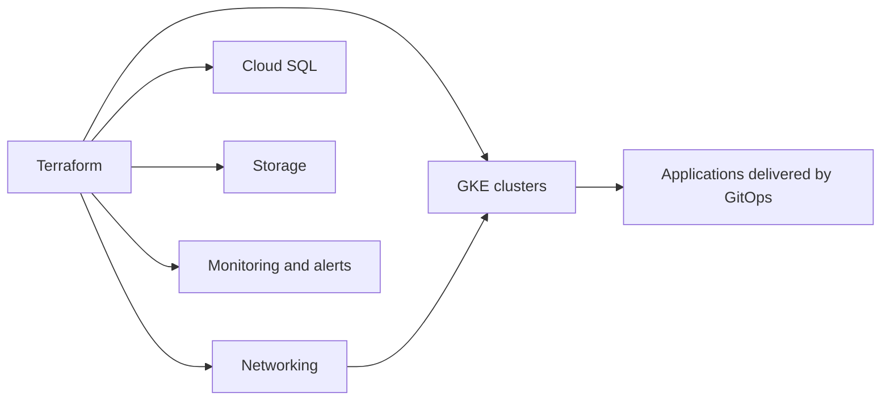

# Infrastructure

This folder contains the infrastructure code for running TeamPulse Bridge in Google Cloud.

It is written to support production-style environments, not just local demos.

That includes Terraform modules, environment configuration, deployment scripts, and supporting documentation for staging and production operations.

## What This Folder Is For

The infrastructure layer answers questions like:

- what cloud resources does the system need
- how are staging and production separated
- how do we provision clusters, networking, storage, and monitoring
- how do we keep infrastructure changes reviewable and repeatable

## High-Level View



## Folder Guide

- `terraform/`: root Terraform configuration, reusable modules, and environment tfvars
- `scripts/`: helper scripts for backend setup, deploy, destroy, and GitOps bootstrap
- `docs/`: deeper infrastructure-specific operational documentation

## Quick Start

### 1. Initialize the Terraform backend

From `infrastructure/scripts/`:

```bash
./init-backend.sh staging your-gcp-project-id your-terraform-state-bucket
```

Run this once per environment before the first apply.

### 2. Plan or deploy from the repository root

```bash
make infra-plan-staging
make infra-deploy-staging
```

For production:

```bash
make infra-plan-prod
make infra-deploy-prod
```

Production changes should go through review and normal change-control practices.

## GitOps Relationship

Infrastructure and deployment are related but not identical:

- `infrastructure/` creates the cloud foundations
- `deploy/` defines what runs on top of those foundations

Argo CD bootstrap support is provided here through:

- `scripts/bootstrap-gitops-argocd.sh`

Related deployment assets live in:

- [../deploy/k8s/](../deploy/k8s)
- [../deploy/gitops/argocd/](../deploy/gitops/argocd)

Validate GitOps manifests from the repository root with:

```bash
make gitops-validate
```

## Terraform Structure

```text
terraform/
  main.tf
  variables.tf
  outputs.tf
  providers.tf
  backend.tf
  environments/
    staging/
    prod/
  modules/
    database/
    gke_cluster/
    monitoring/
    networking/
    security/
    storage/

scripts/
  init-backend.sh
  deploy.sh
  destroy.sh
  bootstrap-gitops-argocd.sh

docs/
  README.md
```

## What the Modules Cover

- `modules/networking`: VPCs, subnets, firewalls, and related network controls
- `modules/gke_cluster`: GKE clusters and node pools
- `modules/database`: Cloud SQL and database backup posture
- `modules/monitoring`: dashboards, alerts, and observability plumbing
- `modules/security`: IAM and security-oriented infrastructure concerns
- `modules/storage`: buckets and storage lifecycle configuration

## Environment Model

The repository is structured around at least two clear environments:

- staging for safer iteration and validation
- production for higher durability and stronger operational controls

The infrastructure also supports an optional multi-region active-active model for more advanced production setups.

If you enable that model, make sure the application and data layers are designed for it before treating both regions as writable.

For resilience validation, use the regional failover drill documented in [docs/regional-failover-drill.md](docs/regional-failover-drill.md).

From the repository root, operators can run `make infra-chaos-drill-failover` after exporting the required health-check URLs and any failover or recovery commands for the target environment.

## Safety Notes

- review `terraform plan` output before every apply
- do not manually edit remote Terraform state
- keep production applies behind review and approval
- production IAM exceptions must carry a ticket, expiry date, and are automatically time-bounded in Terraform
- structured security audit logs are routed into a dedicated Cloud Logging bucket with separate retention
- treat `destroy.sh` as a restricted operation, especially outside non-prod
- validate backup and restore assumptions, not just deployment success

## Useful Commands

From the repository root:

```bash
make infra-plan-staging
make infra-plan-prod
```

From `infrastructure/terraform/`:

```bash
terraform fmt -recursive
terraform validate
terraform plan -var-file=environments/staging/terraform.tfvars
terraform plan -var-file=environments/prod/terraform.tfvars
```

## Where To Look Next

- [terraform/README.md](terraform/README.md)
- [docs/README.md](docs/README.md)
- [../deploy/README.md](../deploy/README.md)
