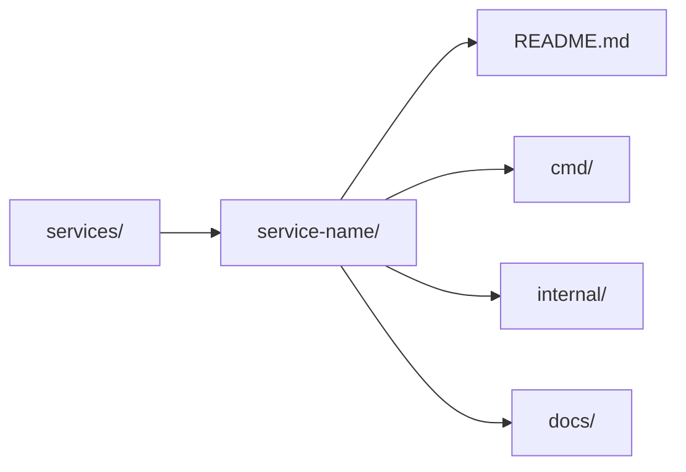

# Services

This folder is where TeamPulse Bridge keeps runnable application code.

If you want to know "what actually runs" in this repository, start here.

## What Belongs in `services/`

A folder belongs here when it is a real service that can be started, tested, deployed, and operated on its own.

That usually means it has:

- a clear runtime responsibility
- its own entrypoints under `cmd/`
- private implementation packages under `internal/`
- a local development story
- tests close to the code
- a README that explains what the service does and how to use it

## Current Services

### `ingestion-gateway/`

The ingestion gateway is the current production-style service in this repo.

It receives webhooks from Slack, Teams, GitHub, and GitLab, validates them, wraps them in a normalized envelope, and publishes them to a queue for downstream processing.

Start here if you want the main application code:

- [ingestion-gateway/README.md](ingestion-gateway/README.md)
- [ingestion-gateway/cmd/server/main.go](ingestion-gateway/cmd/server/main.go)
- [ingestion-gateway/internal/handlers/](ingestion-gateway/internal/handlers)
- [ingestion-gateway/internal/queue/](ingestion-gateway/internal/queue)

## How To Read a Service Quickly

For most services in this repo, the fastest path is:

1. read the service `README.md`
2. open `cmd/server/main.go` or the main entrypoint
3. inspect `internal/handlers` or the request boundary
4. inspect `internal/queue`, storage, or external integrations

## Service Expectations

Every service should aim to include:

- `README.md` with purpose, quick start, API surface, and operational notes
- `cmd/` entrypoints for the binaries we actually run
- `internal/` packages for private application code
- tests near the code they validate
- supporting docs if the service has non-trivial integration or operational behavior

## Engineering Rules

- keep service boundaries explicit
- avoid cross-service imports through `internal/`
- create shared libraries only when reuse is real, not hypothetical
- document operational behavior in the service README, not only in source code
- prefer simple service ownership over clever monorepo abstractions

## Adding a New Service

If this repository grows beyond the ingestion gateway, a new service should arrive with:

- a clear reason for existing separately
- its own README and entrypoint
- tests and run instructions
- deployment and config story defined from day one

That keeps `services/` easy to understand instead of becoming a folder full of half-started experiments.
