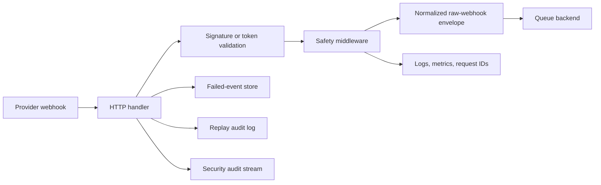

# Ingestion Gateway

The ingestion gateway is the main runnable service in TeamPulse Bridge.

Its job is simple to describe and important to get right:

- accept webhook requests from developer platforms
- verify that those requests are legitimate
- preserve the original payload and important headers
- publish the event to a queue for downstream processing
- give operators safe tools to inspect failures and replay events

If the repository is the front door for engineering activity signals, this service is the lock, the doorbell, and the intake desk.

## What This Service Is For

Different providers send different webhook formats and use different security rules.

Slack signs requests one way. GitHub signs them another way. GitLab and Teams have their own rules too. On top of that, production systems still need rate limits, request tracing, observability, and a safe way to recover from failed publishes.

This service brings all of that into one place.

It currently supports:

- Slack
- Microsoft Teams
- GitHub
- GitLab

## What Happens to a Request



In practice, that means:

1. a provider sends a webhook to one of the `/webhooks/*` endpoints
2. the gateway checks the signature or token
3. middleware applies request IDs, rate limiting, logging, and recovery
4. the payload is wrapped in a consistent queue envelope
5. the event is published to either the log backend or Google Pub/Sub
6. if publishing fails, the event can be stored and replayed later

## Main Features

- webhook validation for Slack, Teams, GitHub, and GitLab
- request body limits and panic-safe request handling
- request ID propagation through `X-Request-Id`
- structured logging and observability hooks
- queue abstraction with `log` and `pubsub` backends
- built-in operator UI at `GET /`
- failed-event persistence for replay workflows
- replay audit history with filtering and pagination
- optional JWT and CIDR protection for admin routes

## Quick Start

Commands below assume your current directory is:

```bash
cd services/ingestion-gateway
```

### 1. Prepare local configuration

From the repository root, create a local `.env` file from `.env.example`.

For local development, the defaults are already set up for a friendly start:

- `REQUIRE_SECRETS=false`
- `QUEUE_BACKEND=log`
- `ADMIN_AUTH_ENABLED=false`
- `ENVIRONMENT=local`

That means you can run the service locally without real provider secrets while you are developing.

### 2. Run the local doctor

```bash
go run ./cmd/doctor
```

This checks the local environment and calls out missing tools or config.

### 3. Start the server

```bash
go run ./cmd/server
```

### 4. Open the service

- operator UI: `http://localhost:8080/`
- health: `http://localhost:8080/healthz`
- readiness: `http://localhost:8080/readyz`
- metrics: `http://localhost:8080/metrics`

## API Surface

Public and operator-facing routes:

- `GET /`
- `GET /assets/ui.css`
- `GET /assets/ui.js`
- `GET /healthz`
- `GET /readyz`
- `GET /metrics`
- `GET /admin/configz`
- `GET /admin/events/failed`
- `GET /admin/events/replay-audit`
- `GET /admin/events/security-audit`
- `POST /admin/events/replay`
- `POST /admin/events/replay/batch`
- `POST /webhooks/slack`
- `POST /webhooks/teams`
- `POST /webhooks/github`
- `POST /webhooks/gitlab`
- `POST /ui/smoke-test`

## Operator UI

The root route, `GET /`, serves a built-in operator console.

This UI is meant to help someone understand the health of the service without having to manually curl every endpoint.

It includes:

- live health and readiness checks
- config visibility through `/admin/configz`
- optional admin JWT mode for protected environments
- failed-event browsing
- batch dry-run and batch replay for failed events
- replay audit browsing with filters for actor, event ID, result, and sort order
- security audit inspection for rejected admin and webhook requests
- controlled webhook smoke testing through an internal proxy

The UI is especially useful when you are validating environments, debugging a publish issue, or checking replay history after an incident.

## Failed Events and Replay

When failed-event storage is enabled, publish failures can be written to a JSONL store so they are not lost.

By default, the service uses:

- `data/failed-events.jsonl` for failed events
- `data/replay-audit.jsonl` for replay audit history
- `data/security-audit.jsonl` for structured security audit events

### Replay paths

There are two ways to replay:

1. use the operator UI
2. use the replay CLI

### Batch replay behavior

The batch replay admin endpoint:

- accepts a list of event IDs
- deduplicates repeated IDs
- supports dry-run and real replay
- returns per-item results and summary counts
- accepts at most 25 unique event IDs per request

### Replay audit behavior

Replay audit records can be filtered by:

- `actor`
- `event_id`
- `result`
- `sort`

The admin API also supports cursor pagination through `limit` and `cursor`.

## Replay CLI

The `cmd/replay` tool is useful when you want to validate a payload locally or replay a stored failed event without using the UI.

Replay accepts two input shapes:

1. raw provider payload JSON, which requires `-source`
2. wrapped replay input containing `source`, `headers`, and `body`

Examples:

```bash
# Validate a raw payload without publishing
go run ./cmd/replay \
  -file internal/handlers/testdata/contracts/github_pull_request_opened.json \
  -source github \
  -dry-run

# Publish with an extra header override
go run ./cmd/replay \
  -file internal/handlers/testdata/contracts/github_pull_request_opened.json \
  -source github \
  -header X-Replay=true

# Replay a failed event from the failed-event store
go run ./cmd/replay -event-id fev_0123456789abcdef
```

If you want replay to publish to Pub/Sub, set:

- `QUEUE_BACKEND=pubsub`
- `PUBSUB_PROJECT_ID=<project>`
- `PUBSUB_TOPIC_ID=<topic>`

## Configuration

The full configuration surface is environment-variable driven.

### Variables most people care about first

Runtime behavior:

- `PORT` default `8080`
- `REQUEST_TIMEOUT_SEC` default `15`
- `QUEUE_BACKEND` default `log`
- `QUEUE_BUFFER` default `4096`
- `QUEUE_BACKPRESSURE_ENABLED` default `true`
- `QUEUE_BACKPRESSURE_SOFT_LIMIT_PERCENT` default `70`
- `QUEUE_BACKPRESSURE_HARD_LIMIT_PERCENT` default `90`
- `QUEUE_FAILURE_BUDGET_PERCENT` default `15`
- `QUEUE_FAILURE_BUDGET_WINDOW` default `100`
- `QUEUE_FAILURE_BUDGET_MIN_SAMPLES` default `20`
- `QUEUE_THROTTLE_RETRY_AFTER_SEC` default `5`
- `ENVIRONMENT` default `dev`

Safety and traffic controls:

- `RATE_LIMIT_ENABLED` default `true`
- `RATE_LIMIT_RPM` default `300`
- `ADMIN_RATE_LIMIT_RPM` default `60`
- `DEDUP_ENABLED` default `true`
- `DEDUP_TTL_SEC` default `300`

Failed-event and replay storage:

- `FAILED_EVENT_STORE_ENABLED` default `true`
- `FAILED_EVENT_STORE_PATH` default `data/failed-events.jsonl`
- `REPLAY_AUDIT_ENABLED` default `true`
- `REPLAY_AUDIT_PATH` default `data/replay-audit.jsonl`
- `SECURITY_AUDIT_ENABLED` default `true`
- `SECURITY_AUDIT_PATH` default `data/security-audit.jsonl`
- `SECURITY_AUDIT_RETENTION_DAYS` default `30`

Proxy and tracing support:

- `TRUSTED_PROXY_CIDRS`
- `OTEL_EXPORTER_OTLP_ENDPOINT`

### Provider secrets

These are required when `REQUIRE_SECRETS=true`:

- `SLACK_SIGNING_SECRET`
- `GITHUB_WEBHOOK_SECRET`
- `GITLAB_WEBHOOK_TOKEN`
- `TEAMS_CLIENT_STATE`

### Pub/Sub configuration

These are required when `QUEUE_BACKEND=pubsub`:

- `PUBSUB_PROJECT_ID`
- `PUBSUB_TOPIC_ID`
- `PUBSUB_EMULATOR_HOST` for local emulator-based testing

### Admin protection

These matter when `ADMIN_AUTH_ENABLED=true`:

- `ADMIN_AUTH_ENABLED`
- `ADMIN_JWT_ISSUER`
- `ADMIN_JWT_AUDIENCE`
- `ADMIN_JWT_SECRET`
- `ADMIN_ALLOW_CIDRS`

### Important validation rules

- `QUEUE_BACKEND` must be `log` or `pubsub`
- queue backpressure limits must be ordered so hard limit is greater than soft limit
- queue failure budget sample size must not exceed the configured rolling window
- `DEDUP_TTL_SEC` must be between `1` and `86400`
- `FAILED_EVENT_STORE_PATH` must be set when failed-event storage is enabled
- `REPLAY_AUDIT_PATH` must be set when replay audit is enabled
- `SECURITY_AUDIT_PATH` must be set when security audit is enabled
- `SECURITY_AUDIT_RETENTION_DAYS` must be between `1` and `3650`
- `ADMIN_JWT_SECRET` must be strong and at least 32 characters
- `REQUIRE_SECRETS=false` is only allowed in non-production-style environments
- trusted forwarded headers are only honored for sources in `TRUSTED_PROXY_CIDRS`

## Local Development

### Run tests

```bash
go test ./...
```

### Run integration tests with the Pub/Sub emulator

From the repository root:

```bash
make integration-test
```

Useful targeted runs:

```bash
make contract-test
make integration-test-queue
make integration-test-handlers
make integration-bench
```

Integration tests skip automatically when `PUBSUB_EMULATOR_HOST` is not set.

More detail lives in [docs/INTEGRATION_TESTS.md](docs/INTEGRATION_TESTS.md).

## Queue Contract

This service publishes a versioned raw webhook envelope to the queue backend.

The current schema is documented here:

- `internal/queue/testdata/schemas/raw-webhook-envelope-v1.schema.json`
- `internal/handlers/testdata/contracts/catalog-v1.json`
- [docs/WEBHOOK_COMPATIBILITY_MATRIX.md](docs/WEBHOOK_COMPATIBILITY_MATRIX.md)

That schema is the stable contract between ingress and downstream consumers.

The fixture catalog and compatibility matrix are the maintainers' source of truth for provider coverage, negative payload variants, and schema drift protection.

## Operational Notes

If you are running this somewhere shared or production-like, these defaults are worth keeping in mind:

- keep `REQUIRE_SECRETS=true`
- keep `ADMIN_AUTH_ENABLED=true`
- prefer `QUEUE_BACKEND=pubsub` for durability
- monitor `5xx` responses and publish failures
- treat the failed-event store and replay audit log as operational data, not temporary debug output
- treat the security audit stream as retained incident-response evidence, not debug-only logs

## Troubleshooting

### Webhook requests are failing with `401` or `403`

Check:

- whether the correct provider secret or token is configured
- whether the provider is signing the exact payload being received
- whether the expected signature headers are present

### Publish requests are failing with `500` or `503`

Check:

- queue backend connectivity
- Pub/Sub topic existence
- credentials or emulator configuration
- whether failed-event storage is capturing the failed payload for later replay

### The operator UI cannot load admin data

Check:

- whether `ADMIN_AUTH_ENABLED` is on
- whether the browser request includes a valid JWT when auth is enabled
- whether the source IP is allowed by `ADMIN_ALLOW_CIDRS`

### Replay looks enabled but nothing is happening

Check:

- whether the event exists in the failed-event store
- whether you are running a dry-run instead of a real replay
- whether the configured queue backend is publishable in the current environment
- whether replay audit logs show a validation failure instead of a publish failure

## Where To Look Next

If you want to understand the code quickly, start with:

- [cmd/server/main.go](cmd/server/main.go)
- [cmd/replay/main.go](cmd/replay/main.go)
- [internal/handlers/](internal/handlers)
- [internal/queue/](internal/queue)
- [internal/config/config.go](internal/config/config.go)
- [docs/INTEGRATION_TESTS.md](docs/INTEGRATION_TESTS.md)
