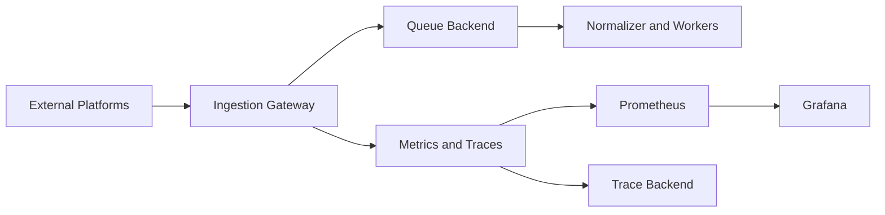

# Architecture Overview

## Design Principles

- Stateless horizontal scaling
- Signature-verified ingestion
- Async processing and backpressure handling
- Strong observability as default
- Clear operational contracts and runbooks
